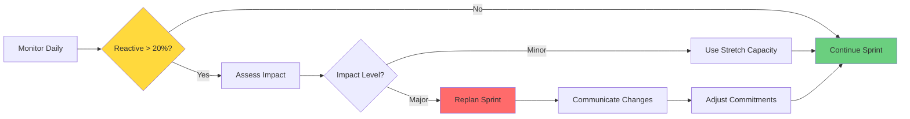

# Capacity Management Guide

**Strategic framework for balancing planned work with reactive needs using the 80/20 allocation model.**

## 🎯 Core Philosophy

### The 80/20 Principle
- **80% Planned Work**: Predictable, committed deliverables
- **20% Reactive Work**: Urgent issues, opportunities, and discoveries

This split acknowledges reality: no sprint goes exactly as planned, but most work should be predictable.

## 📊 Capacity Calculation

### Base Formula
```
Total Capacity = Team Size × Days × Focus Factor × Velocity

Where:
- Team Size = Number of developers
- Days = Working days in sprint (typically 5)
- Focus Factor = Productive hours ratio (typically 0.6-0.8)
- Velocity = Historical story points per person per day
```

### Example Calculation
```
Team: 4 developers
Sprint: 5 days
Focus Factor: 0.7 (accounting for meetings, context switching)
Velocity: 2 points/person/day

Total Capacity = 4 × 5 × 0.7 × 2 = 28 story points

Planned Work (80%) = 28 × 0.8 = 22 points
Reactive Work (20%) = 28 × 0.2 = 6 points
```

## 🗂️ Capacity Allocation

### 80% - Planned Work

#### What Goes Here
- **Release features**: Committed roadmap items
- **Scheduled improvements**: Planned refactoring
- **Technical debt**: Scheduled paydown
- **Documentation**: Planned updates
- **Testing**: Test coverage improvements

#### Planning Process
```bash
# During sprint planning
make sprint-plan

# Review release commitments
make release-status

# Select features for sprint
make feature-list stage=approved

# Create tasks with story points
make task-create title="..." feature=X decision=Y points=8
```

#### Commitment Strategy
1. **Core Features** (60% of planned capacity)
   - Must-have for release
   - Dependencies for other work
   - Customer commitments

2. **Important Features** (30% of planned capacity)
   - Should-have for release
   - High value improvements
   - Technical debt paydown

3. **Stretch Goals** (10% of planned capacity)
   - Nice-to-have features
   - Optimizations
   - Developer experience

### 20% - Reactive Work

#### What Goes Here
- **P0 Issues**: Production emergencies
- **P1 Issues**: High-priority bugs
- **Urgent Requests**: Time-sensitive opportunities
- **Discoveries**: Issues found during development
- **Support**: Customer escalations

#### Management Strategy
```bash
# Monitor reactive capacity usage
make sprint-capacity-status

# Check incoming issues
make backlog-list severity=P0,P1

# Assign to reactive capacity
make backlog-assign issue=BUG-P0-XXX sprint=current capacity=reactive
```

#### Overflow Handling
When reactive work exceeds 20%:

1. **Immediate (P0)**:
   - Drop stretch goals first
   - Defer important features if needed
   - Protect core features if possible

2. **Urgent (P1)**:
   - Negotiate scope reduction
   - Move to next sprint if possible
   - Request additional resources

3. **Important (P2)**:
   - Queue for next sprint
   - Bundle with related work
   - Add to backlog

## 📈 Capacity Patterns

### Sprint Types & Allocation

#### Innovation Sprint
- **Planned**: 90% (new features, experiments)
- **Reactive**: 10% (minimal support)
- **When**: Early in release cycle

#### Stabilization Sprint
- **Planned**: 60% (bug fixes, polish)
- **Reactive**: 40% (issue resolution)
- **When**: Before major release

#### Standard Sprint
- **Planned**: 80% (normal development)
- **Reactive**: 20% (typical issues)
- **When**: Most sprints

#### Support Sprint
- **Planned**: 40% (critical fixes only)
- **Reactive**: 60% (customer issues)
- **When**: After major incidents

### Team Patterns

#### Senior-Heavy Team
```
Capacity Multiplier: 1.2x
Planned: 85% (can handle complexity)
Reactive: 15% (efficient problem solving)
```

#### Junior-Heavy Team
```
Capacity Multiplier: 0.8x
Planned: 75% (need more buffer)
Reactive: 25% (more discoveries)
```

#### Mixed Team
```
Capacity Multiplier: 1.0x
Planned: 80% (standard)
Reactive: 20% (standard)
```

## 🔄 Dynamic Adjustment

### Weekly Capacity Review
```bash
# Monday - Sprint Start
make sprint-capacity-check
# Allocate initial 80/20

# Wednesday - Mid-Sprint
make sprint-capacity-status
# Adjust if reactive exceeding 20%

# Friday - Sprint End
make sprint-capacity-report
# Analyze actual vs planned
```

### Adjustment Triggers

#### Increase Reactive Allocation
- Multiple P0/P1 issues pending
- Customer escalations increasing
- Technical instability detected
- Post-release bug reports

#### Decrease Reactive Allocation
- Stable system metrics
- Low issue inflow
- Strong test coverage
- Mature codebase

### Rebalancing Process


## 📊 Capacity Metrics

### Tracking Metrics
```bash
# Real-time capacity
make capacity-dashboard

# Historical analysis
make capacity-trends period=quarter
```

#### Key Metrics
1. **Planned vs Actual**: How accurate are estimates?
2. **Reactive Overflow**: How often exceed 20%?
3. **Velocity Trend**: Getting faster or slower?
4. **Focus Factor**: How much time is productive?

### Health Indicators

#### 🟢 Healthy Capacity
- Planned work: 75-85% complete
- Reactive work: 15-25% of time
- Velocity: Stable or improving
- Team morale: High

#### 🟡 Stressed Capacity
- Planned work: 50-75% complete
- Reactive work: 25-40% of time
- Velocity: Declining
- Team morale: Medium

#### 🔴 Overloaded Capacity
- Planned work: <50% complete
- Reactive work: >40% of time
- Velocity: Erratic
- Team morale: Low

## 🎯 Capacity Optimization

### Improving Planned Capacity

#### Better Estimation
- Historical velocity analysis
- Team estimation sessions
- Reference similar tasks
- Include buffer for unknowns

#### Reduce Waste
- Minimize meeting time
- Improve tooling
- Automate repetitive tasks
- Clear requirements upfront

### Reducing Reactive Load

#### Prevention
- Better testing (reduce P0/P1)
- Code reviews (catch issues early)
- Monitoring (detect before customers)
- Documentation (reduce support)

#### Efficiency
- Runbooks for common issues
- AI-powered triage
- Quick fix patterns
- Escalation clarity

## 🔧 Tools & Commands

### Capacity Planning
```bash
# Sprint planning with capacity
make sprint-plan capacity=28 planned=22 reactive=6

# Check current allocation
make capacity-status

# Forecast next sprint
make capacity-forecast team=4 days=5
```

### Capacity Monitoring
```bash
# Daily capacity check
make capacity-daily

# Sprint capacity trends
make capacity-burndown

# Team utilization
make capacity-utilization
```

### Capacity Reporting
```bash
# Sprint retrospective
make capacity-retrospective

# Monthly report
make capacity-report month=2025-09

# Quarterly analysis
make capacity-analysis quarter=Q3-2025
```

## 📋 Capacity Templates

### Sprint Planning Template
```markdown
## Sprint Capacity Planning

**Sprint**: SPRINT-2025-W40
**Team Size**: 4 developers
**Duration**: 5 days

### Capacity Calculation
- Base Capacity: 4 × 5 = 20 person-days
- Focus Factor: 0.7
- Velocity: 2 points/day
- **Total**: 28 story points

### Allocation
- **Planned (80%)**: 22 points
  - Core Features: 13 points
  - Important Work: 7 points
  - Stretch Goals: 2 points

- **Reactive (20%)**: 6 points
  - P0/P1 Reserve: 4 points
  - Discoveries: 2 points

### Risk Factors
- [ ] Team member PTO?
- [ ] Dependencies on other teams?
- [ ] Unstable areas in code?
- [ ] Recent production issues?
```

### Capacity Report Template
```markdown
## Sprint Capacity Report

**Sprint**: SPRINT-2025-W39
**Date**: 2025-09-20

### Planned vs Actual
| Category | Planned | Actual | Variance |
|----------|---------|--------|----------|
| Planned Work | 22 pts | 19 pts | -14% |
| Reactive Work | 6 pts | 9 pts | +50% |
| Total | 28 pts | 28 pts | 0% |

### Reactive Breakdown
- P0 Issues: 4 points (1 incident)
- P1 Issues: 3 points (2 bugs)
- Discoveries: 2 points (testing)

### Lessons Learned
- Underestimated complexity of Feature X
- P0 incident could have been prevented
- Good decision to keep stretch goals minimal

### Next Sprint Adjustments
- Increase reactive to 25% (7 points)
- Add monitoring for problematic service
- Schedule debt paydown for stability
```

## 🚀 Best Practices

### ✅ DO
- **Track actual capacity** religiously
- **Adjust based on data**, not feelings
- **Protect core commitments** fiercely
- **Communicate changes** immediately
- **Learn from overruns** systematically
- **Celebrate good planning** when it works

### ❌ DON'T
- **Overcommit** planned capacity
- **Ignore reactive** work reality
- **Hide capacity issues** from stakeholders
- **Blame the team** for overruns
- **Skip retrospectives** on capacity
- **Assume perfect** execution

## 🎓 Capacity Maturity Model

### Level 1: Reactive
- No capacity planning
- Everything is urgent
- Constant firefighting
- Low predictability

### Level 2: Basic Planning
- Simple capacity estimates
- Some planned vs reactive
- Occasional overruns
- Improving predictability

### Level 3: Structured (Target)
- **80/20 allocation model**
- Data-driven adjustments
- Proactive prevention
- Good predictability

### Level 4: Optimized
- Dynamic reallocation
- Predictive analytics
- Minimal reactive work
- High predictability

### Level 5: Adaptive
- Self-adjusting capacity
- AI-assisted planning
- Near-zero emergencies
- Perfect predictability

## 🔗 Integration Points

### With Backlog System
- P0/P1 issues consume reactive capacity
- P2+ issues wait for planned capacity
- Triage considers available capacity

### With Parking Lot
- Promoted items need capacity allocation
- Consider capacity when promoting
- Innovation sprints from parking lot items

### With Release Planning
- Release capacity = Sum of sprint capacities
- Account for capacity variations
- Build buffer into release timeline

## Quick Reference

### Capacity Commands
```bash
# Planning
make capacity-plan sprint=SPRINT-2025-W40 team=4

# Monitoring
make capacity-status
make capacity-daily
make capacity-burndown

# Reporting
make capacity-report sprint=current
make capacity-trends period=quarter

# Adjustment
make capacity-rebalance planned=70 reactive=30
```

### Capacity Formulas
```
Total = Team × Days × Focus × Velocity
Planned = Total × 0.8
Reactive = Total × 0.2
Buffer = Reactive - Actual Issues
```

---

**Remember**: The 80/20 model isn't rigid - it's a starting point. Use data to find your team's optimal balance between predictability and flexibility.