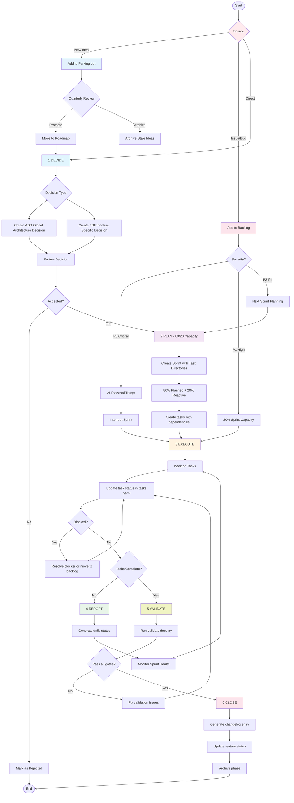
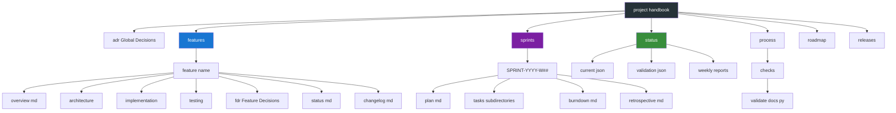
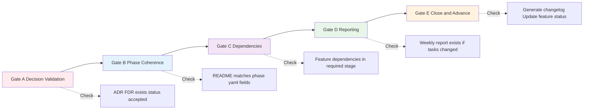
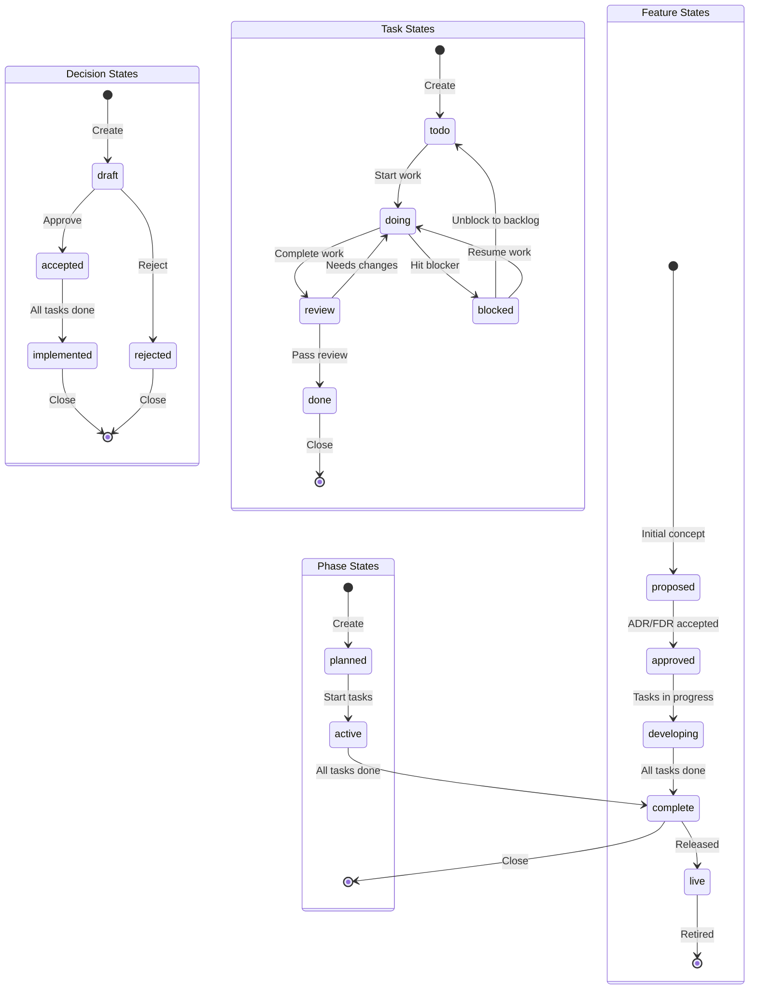

# Project Handbook Workflow

## Lifecycle Flow with Backlog & Parking Lot

```mermaid
graph TD
    Start([Start]) --> Source{Source}

    Source -->|New Idea| ParkingLot[Add to Parking Lot]
    Source -->|Issue/Bug| Backlog[Add to Backlog]
    Source -->|Direct| Decide[1 DECIDE]

    ParkingLot --> QuarterlyReview{Quarterly Review}
    QuarterlyReview -->|Promote| Roadmap[Move to Roadmap]
    QuarterlyReview -->|Archive| Archive[Archive Stale Ideas]
    Roadmap --> Decide

    Backlog --> Triage{Severity?}
    Triage -->|P0 Critical| AITriage[AI-Powered Triage]
    AITriage --> ImmediateAction[Interrupt Sprint]
    Triage -->|P1 High| ReactiveCapacity[20% Sprint Capacity]
    Triage -->|P2-P4| NextSprint[Next Sprint Planning]

    ImmediateAction --> Execute
    ReactiveCapacity --> Execute
    NextSprint --> Plan

    Decide --> CreateDecision{Decision Type}
    CreateDecision --> ADR[Create ADR Global Architecture Decision]
    CreateDecision --> FDR[Create FDR Feature Specific Decision]

    ADR --> Review[Review Decision]
    FDR --> Review

    Review --> Accept{Accepted?}
    Accept -->|No| Reject[Mark as Rejected]
    Reject --> End([End])

    Accept -->|Yes| Plan[2 PLAN - 80/20 Capacity]

    Plan --> CreateSprint[Create Sprint with Task Directories]
    CreateSprint --> AllocateCapacity[80% Planned + 20% Reactive]
    AllocateCapacity --> CreateTasks[Create tasks with dependencies]

    CreateTasks --> Execute[3 EXECUTE]

    Execute --> WorkOnTasks[Work on Tasks]
    WorkOnTasks --> UpdateStatus[Update task status in tasks yaml]
    UpdateStatus --> HandleBlockers{Blocked?}
    HandleBlockers -->|Yes| ResolveBlocker[Resolve blocker or move to backlog]
    ResolveBlocker --> UpdateStatus
    HandleBlockers -->|No| CheckProgress{Tasks Complete?}

    CheckProgress -->|No| Report[4 REPORT]
    Report --> DailyStatus[Generate daily status]
    DailyStatus --> SprintHealth[Monitor Sprint Health]
    SprintHealth --> WorkOnTasks

    CheckProgress -->|Yes| Validate[5 VALIDATE]
    Validate --> RunValidation[Run validate docs py]
    RunValidation --> ValidationPass{Pass all gates?}
    ValidationPass -->|No| FixIssues[Fix validation issues]
    FixIssues --> UpdateStatus

    ValidationPass -->|Yes| Close[6 CLOSE]
    Close --> GenerateChangelog[Generate changelog entry]
    GenerateChangelog --> UpdateFeature[Update feature status]
    UpdateFeature --> ArchivePhase[Archive phase]
    ArchivePhase --> End

    style Source fill:#ffebee
    style ParkingLot fill:#e3f2fd
    style Backlog fill:#fce4ec
    style Decide fill:#e1f5fe
    style Plan fill:#f3e5f5
    style Execute fill:#fff3e0
    style Report fill:#e8f5e9
    style Validate fill:#f0f4c3
    style Close fill:#fce4ec
```

## Directory Structure

```mermaid
graph TD
    Root[project handbook] --> ADRDir[adr Global Decisions]
    Root --> Features[features]
    Root --> Sprints[sprints]
    Root --> Status[status]
    Root --> Process[process]
    Root --> Roadmap[roadmap]
    Root --> Releases[releases]

    Features --> FeatureX[feature name]
    FeatureX --> Overview[overview md]
    FeatureX --> Architecture[architecture]
    FeatureX --> Implementation[implementation]
    FeatureX --> Testing[testing]
    FeatureX --> FDRDir[fdr Feature Decisions]
    FeatureX --> FeatureStatus[status md]
    FeatureX --> FeatureChangelog[changelog md]

    Sprints --> SprintDir[SPRINT-YYYY-W##]
    SprintDir --> SprintPlan[plan md]
    SprintDir --> TaskDirs[tasks subdirectories]
    SprintDir --> Burndown[burndown md]
    SprintDir --> Retrospective[retrospective md]

    Status --> CurrentJson[current json]
    Status --> ValidationJson[validation json]
    Status --> WeeklyReports[weekly reports]

    Process --> Checks[checks]
    Checks --> ValidateScript[validate docs py]

    style Root fill:#263238,color:#fff
    style Features fill:#1976d2,color:#fff
    style Sprints fill:#7b1fa2,color:#fff
    style Status fill:#388e3c,color:#fff
```

## Validation Gates

```mermaid
graph LR
    GateA[Gate A Decision Validation] --> GateB[Gate B Phase Coherence]
    GateB --> GateC[Gate C Dependencies]
    GateC --> GateD[Gate D Reporting]
    GateD --> GateE[Gate E Close and Advance]

    GateA -.->|Check| A1[ADR FDR exists status accepted]
    GateB -.->|Check| B1[README matches phase yaml fields]
    GateC -.->|Check| C1[Feature dependencies in required stage]
    GateD -.->|Check| D1[Weekly report exists if tasks changed]
    GateE -.->|Check| E1[Generate changelog Update feature status]

    style GateA fill:#ffebee
    style GateB fill:#e3f2fd
    style GateC fill:#f3e5f5
    style GateD fill:#e8f5e9
    style GateE fill:#fff3e0
```

## State Transitions

```mermaid
stateDiagram-v2
    direction TB

    state "Decision States" as Decision {
        [*] --> draft: Create
        draft --> accepted: Approve
        draft --> rejected: Reject
        accepted --> implemented: All tasks done
        implemented --> [*]: Close
        rejected --> [*]: Close
    }

    state "Task States" as Task {
        [*] --> todo: Create
        todo --> doing: Start work
        doing --> review: Complete work
        doing --> blocked: Hit blocker
        review --> done: Pass review
        review --> doing: Needs changes
        blocked --> todo: Unblock to backlog
        blocked --> doing: Resume work
        done --> [*]: Close
    }

    state "Phase States" as Phase {
        [*] --> planned: Create
        planned --> active: Start tasks
        active --> complete: All tasks done
        complete --> [*]: Close
    }

    state "Feature States" as Feature {
        [*] --> proposed: Initial concept
        proposed --> approved: ADR/FDR accepted
        approved --> developing: Tasks in progress
        developing --> complete: All tasks done
        complete --> live: Released
        live --> [*]: Retired
    }
```