# Incident Response Guide

**Rapid response framework for P0 critical issues and production incidents.**

## 🚨 P0 Incident Definition

A P0 (Critical) incident is any issue that:
- **Production Down**: Complete system or major service unavailable
- **Data Loss**: Actual or imminent data corruption/loss
- **Security Breach**: Active exploitation or vulnerability
- **Revenue Impact**: >$10K/hour or critical business transaction failure
- **User Impact**: >50% of users affected with no workaround

## 🔥 Immediate Response Protocol

### Minute 0-5: Detection & Declaration

```bash
# 1. Create P0 issue immediately
make backlog-add type=bug title="[P0] Production API Down" severity=P0 \
  desc="API returning 500 errors for all requests since 14:30 UTC"

# 2. Trigger AI triage for root cause analysis
make backlog-triage issue=BUG-P0-YYYYMMDD-HHMM

# 3. Interrupt current sprint
make backlog-assign issue=BUG-P0-YYYYMMDD-HHMM sprint=current
```

### Minute 5-15: Initial Assessment

**AI Triage Output Review**:
The AI triage will provide:
- **Probable root causes** ranked by likelihood
- **Investigation steps** prioritized by impact
- **Similar historical incidents** for reference
- **Recommended team members** to involve
- **Mitigation suggestions** based on patterns

**Human Actions**:
1. **Confirm impact scope** (users, regions, services)
2. **Establish war room** (Slack channel, video call)
3. **Assign incident commander** (owns coordination)
4. **Begin investigation** following AI suggestions

### Minute 15-30: Mitigation

**Mitigation Priority**:
1. **Stop bleeding**: Prevent further damage
2. **Restore service**: Even if degraded
3. **Preserve evidence**: For root cause analysis
4. **Communicate status**: To stakeholders

**Common Mitigations**:
```bash
# Rollback deployment
make deploy-rollback version=previous

# Scale resources
make infra-scale service=api replicas=10

# Enable circuit breaker
make feature-flag name=circuit-breaker state=on

# Redirect traffic
make traffic-redirect from=primary to=backup
```

## 📊 Incident Severity Classification

### P0 - Critical (Immediate Response)
- **Response Time**: 15 minutes
- **Resolution Target**: 4 hours
- **Sprint Impact**: Immediate interruption
- **Communication**: Executive + Customer notification
- **Post-Incident**: Mandatory RCA within 48 hours

### P1 - High (Same Day)
- **Response Time**: 4 hours
- **Resolution Target**: 24 hours
- **Sprint Impact**: Uses 20% reactive capacity
- **Communication**: Team + Management notification
- **Post-Incident**: RCA if customer-facing

### P2 - Medium (Next Sprint)
- **Response Time**: 2 days
- **Resolution Target**: 1 sprint
- **Sprint Impact**: Next sprint planning
- **Communication**: Team notification
- **Post-Incident**: Optional retrospective

### P3 - Low (Backlog)
- **Response Time**: 1 week
- **Resolution Target**: Best effort
- **Sprint Impact**: Backlog queue
- **Communication**: Tracked in backlog
- **Post-Incident**: None required

### P4 - Trivial (Nice to Have)
- **Response Time**: Best effort
- **Resolution Target**: If convenient
- **Sprint Impact**: Consider parking lot
- **Communication**: None required
- **Post-Incident**: None

## 🎯 Incident Commander Responsibilities

### During Incident
1. **Own coordination** - Single point of decision
2. **Direct resources** - Assign tasks to team members
3. **Manage communication** - Updates every 30 minutes
4. **Make decisions** - Including service degradation
5. **Track timeline** - Document key events and decisions

### Communication Template
```markdown
**[TIME] Status Update**
- **Current State**: [Service up/down/degraded]
- **Impact**: [% users, regions, features affected]
- **Root Cause**: [Known/Under investigation]
- **Actions Taken**: [What we've done]
- **Next Steps**: [What we're doing]
- **ETA**: [Best estimate or "TBD"]
```

## 🔄 Incident Lifecycle

```mermaid
graph LR
    Detect[Detect Issue] --> Declare[Declare P0]
    Declare --> Triage[AI Triage]
    Triage --> Respond[Form Response Team]
    Respond --> Mitigate[Mitigate Impact]
    Mitigate --> Investigate[Find Root Cause]
    Investigate --> Fix[Deploy Fix]
    Fix --> Verify[Verify Resolution]
    Verify --> RCA[Post-Incident RCA]

    style Detect fill:#ff6b6b
    style Declare fill:#ff9f40
    style Triage fill:#4ecdc4
    style RCA fill:#95e1d3
```



## 📝 Post-Incident Process

### Within 24 Hours
```bash
# Create RCA document
make incident-rca issue=BUG-P0-YYYYMMDD-HHMM

# Schedule RCA meeting
make meeting-schedule type=rca issue=BUG-P0-YYYYMMDD-HHMM
```

### RCA Document Structure
1. **Executive Summary** (1 paragraph)
2. **Impact Assessment** (users, duration, revenue)
3. **Timeline of Events** (minute-by-minute)
4. **Root Cause Analysis** (5 Whys)
5. **Contributing Factors** (what made it worse)
6. **What Went Well** (effective responses)
7. **What Went Poorly** (gaps and failures)
8. **Action Items** (prevent recurrence)
   - **P0 Actions**: Must fix before next release
   - **P1 Actions**: Should fix within sprint
   - **P2 Actions**: Backlog for consideration

### Tracking Prevention
```bash
# Create prevention tasks from RCA
make task-create title="Add monitoring for API latency" \
  feature=monitoring decision=ADR-XXX points=5 \
  owner=@sre-team prio=P0

# Track in feature
make feature-create name=incident-prevention-YYYYMMDD \
  owner=@incident-commander stage=approved
```

## 🛠️ Incident Tooling

### Monitoring & Alerting
```bash
# Check system health
make health-check

# View current alerts
make alerts-active

# Historical incidents
make incident-history days=30
```

### War Room Setup
```bash
# Create incident channel
make incident-channel issue=BUG-P0-YYYYMMDD-HHMM

# Start incident bot
make incident-bot start issue=BUG-P0-YYYYMMDD-HHMM

# Enable recording
make incident-record start
```

### Recovery Verification
```bash
# Run smoke tests
make test-smoke

# Check key metrics
make metrics-check service=api window=1h

# Verify customer impact
make customer-impact-check
```

## 📋 Incident Runbooks

### Database Outage
1. Check connection pool exhaustion
2. Review slow query log
3. Check disk space and IOPS
4. Verify backup availability
5. Consider read replica promotion

### API Service Degradation
1. Check request rate and throttling
2. Review error rates by endpoint
3. Check downstream dependencies
4. Review recent deployments
5. Consider circuit breaker activation

### Memory Leak
1. Check heap dumps
2. Review garbage collection logs
3. Identify growing object counts
4. Check for unclosed resources
5. Consider rolling restart

### DDoS Attack
1. Enable rate limiting
2. Activate CDN protection
3. Block suspicious IPs
4. Scale infrastructure
5. Contact hosting provider

## 🎓 Training & Preparedness

### Monthly Drills
- **Game Days**: Simulated P0 incidents
- **Chaos Engineering**: Controlled failures
- **Runbook Review**: Update procedures
- **Tool Training**: New team members

### Quarterly Reviews
- **Incident Metrics**: MTTR, frequency, impact
- **RCA Action Items**: Completion tracking
- **Process Improvements**: Response optimization
- **Tool Evaluation**: Better incident management

## 🔗 Quick Reference

### Emergency Contacts
- **On-Call Engineer**: See PagerDuty
- **Incident Commander Pool**: @incident-commanders
- **Executive Escalation**: @cto, @vp-engineering
- **Customer Success**: @cs-team
- **Security Team**: @security (for breaches)

### Key Commands
```bash
# P0 Response
make backlog-add type=bug severity=P0 title="..." desc="..."
make backlog-triage issue=BUG-P0-XXX
make backlog-assign issue=BUG-P0-XXX sprint=current

# Communication
make incident-update issue=BUG-P0-XXX status="..."
make customer-notify issue=BUG-P0-XXX message="..."

# Recovery
make deploy-rollback
make health-check
make test-smoke
```

---

**Remember**: In a P0 incident, **speed of response** matters more than perfect process. Mitigate first, document later, learn always.