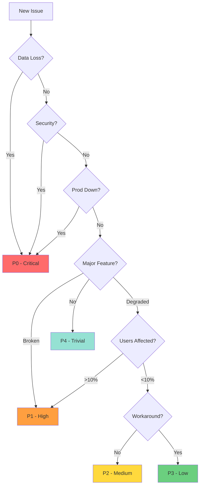

# Playbook - Backlog Triage

## Purpose
Systematically evaluate, prioritize, and assign backlog issues using AI-powered analysis for P0 issues and structured assessment for all severities.

## When
- **P0 Issues**: Immediately upon creation (automated)
- **P1 Issues**: Within 4 hours of creation
- **P2 Issues**: Daily during sprint standup
- **P3/P4 Issues**: Weekly backlog grooming
- **Full Review**: Sprint planning sessions

## Triage Process by Severity

### 🚨 P0 - Critical Issues (Immediate)

#### Step 1: Automated AI Triage
```bash
# Automatically triggered for P0 issues
make backlog-triage issue=BUG-P0-YYYYMMDD-HHMM
```

#### Step 2: Review AI Analysis
The AI triage generates `backlog/bugs/BUG-P0-*/triage.md` with:

```markdown
# AI Triage Analysis - BUG-P0-YYYYMMDD-HHMM

## Executive Summary
[1-2 sentence summary of the issue and likely cause]

## Root Cause Analysis
### Most Likely Causes (Ranked)
1. **[Cause 1]** (85% confidence)
   - Evidence: [Supporting data/logs]
   - Similar incident: [Reference]

2. **[Cause 2]** (60% confidence)
   - Evidence: [Supporting data]
   - Pattern match: [Historical pattern]

3. **[Cause 3]** (30% confidence)
   - Evidence: [Circumstantial]
   - Hypothesis: [Theory]

## Investigation Steps
1. [ ] Check [specific log/metric]
2. [ ] Verify [system component]
3. [ ] Test [specific scenario]
4. [ ] Review [recent changes]

## Recommended Actions
- **Immediate**: [Mitigation steps]
- **Short-term**: [Fix approach]
- **Long-term**: [Prevention strategy]

## Team Recommendations
- Primary: @engineer-familiar-with-area
- Secondary: @subject-matter-expert
- Escalation: @senior-engineer

## Historical Context
- Similar issues: [Links to related bugs]
- Previous fixes: [What worked before]
- Known workarounds: [Temporary solutions]
```

#### Step 3: Human Decision
1. **Validate AI assessment** against current system state
2. **Assign to sprint** immediately
3. **Form response team** based on recommendations
4. **Begin mitigation** following suggested steps

### 🔴 P1 - High Priority (4 Hours)

#### Step 1: Initial Assessment
```bash
# List new P1 issues
make backlog-list severity=P1 status=new

# Quick triage review
make backlog-show issue=BUG-P1-YYYYMMDD-HHMM
```

#### Step 2: Impact Analysis
**Questions to Answer**:
- How many users affected?
- Is there a workaround?
- What functionality is broken?
- Business impact assessment?

#### Step 3: Assignment Decision
```bash
# If urgent enough for current sprint (20% capacity)
make backlog-assign issue=BUG-P1-XXX sprint=current

# Otherwise, next sprint
make backlog-assign issue=BUG-P1-XXX sprint=next
```

### 🟡 P2 - Medium Priority (Daily)

#### Daily Standup Review
```bash
# Morning triage
make backlog-list severity=P2 status=new days=1

# Bulk review interface
make backlog-review severity=P2
```

#### Triage Criteria
- **Promote to P1**: If impact increases
- **Keep P2**: Plan for next sprint
- **Demote to P3**: If workaround sufficient
- **Close**: If no longer valid

### 🟢 P3/P4 - Low Priority (Weekly)

#### Weekly Grooming
```bash
# Weekly review
make backlog-list severity=P3,P4 status=new days=7

# Consider for parking lot
make parking-add type=ideas title="Enhancement from P4 bug" \
  desc="Convert bug fix to feature improvement"
```

## Triage Decision Framework

### Severity Assignment Matrix

| Severity | User Impact | Business Impact | Technical Impact | Response Time |
|----------|------------|-----------------|------------------|---------------|
| **P0** | >50% blocked | Revenue loss | System down | 15 minutes |
| **P1** | 10-50% affected | Feature unusable | Major degradation | 4 hours |
| **P2** | <10% affected | Workaround exists | Performance issue | 2 days |
| **P3** | Individual users | Minor inconvenience | Code quality | 1 week |
| **P4** | Nice to have | No impact | Technical debt | Best effort |

### Decision Tree



## Triage Meeting Format

### Daily P2 Review (5 minutes)
```markdown
**Date**: YYYY-MM-DD
**Participants**: Tech lead + On-call

**New P2 Issues**:
- [ ] BUG-P2-001: [Title] → [Decision]
- [ ] BUG-P2-002: [Title] → [Decision]

**Decisions**: Assign/Defer/Close/Reprioritize
```

### Weekly Backlog Grooming (30 minutes)
```markdown
**Date**: YYYY-MM-DD
**Participants**: Team

**Agenda**:
1. P1 issues status (5 min)
2. P2 issues for next sprint (10 min)
3. P3/P4 review and cleanup (10 min)
4. Parking lot candidates (5 min)

**Outcomes**:
- Sprint candidates: [List]
- Parking lot moves: [List]
- Closed issues: [List]
```

## AI Triage Configuration

### Enabling AI Triage
```bash
# Configure AI model (in validation_rules.json)
{
  "backlog_system": {
    "ai_triage_model": "gpt-4",
    "ai_triage_threshold": "P0",
    "require_triage_for_p0": true
  }
}
```

### AI Triage Prompts
The system uses structured prompts to analyze:
1. **Error patterns** in logs and stack traces
2. **Recent changes** that might correlate
3. **Similar historical issues** and their fixes
4. **System dependencies** that could be affected
5. **Team expertise** mapping for assignment

### Manual AI Triage
```bash
# Trigger AI triage for any severity
make backlog-triage issue=BUG-P2-XXX force=true

# Batch triage for multiple issues
make backlog-triage-batch severity=P1 days=7
```

## Sprint Integration

### Capacity Allocation
```bash
# Check current sprint capacity
make sprint-capacity

# See reactive capacity usage
make sprint-status reactive=true
```

**80/20 Rule Application**:
- **80% Planned**: Features and scheduled work
- **20% Reactive**: P0/P1 issues from backlog

### Assignment Strategy
1. **P0**: Always interrupts sprint
2. **P1**: Uses reactive capacity first
3. **P2**: Next sprint if capacity available
4. **P3/P4**: Backlog unless bundled with related work

## Metrics & Reporting

### Triage Metrics
```bash
# Triage performance
make backlog-metrics type=triage

# Output:
# - Average time to triage by severity
# - AI triage accuracy (P0 issues)
# - Severity drift (reassignments)
# - Resolution time by severity
```

### Backlog Health
```bash
# Backlog statistics
make backlog-stats

# Shows:
# - Total issues by severity
# - Age distribution
# - Assignment status
# - Trend analysis
```

## Best Practices

### ✅ DO
- **Triage P0 immediately** with AI assistance
- **Review P1 within SLA** (4 hours)
- **Batch P2/P3** reviews for efficiency
- **Use parking lot** for enhancements
- **Close stale issues** regularly
- **Track triage metrics** for improvement

### ❌ DON'T
- **Skip AI triage** for P0 issues
- **Let backlog grow** unbounded
- **Change severity** without justification
- **Ignore workarounds** when assessing
- **Mix bugs and features** in backlog

## Escalation Path

### When to Escalate Severity
- **P3→P2**: Multiple users report same issue
- **P2→P1**: Business impact discovered
- **P1→P0**: System degradation accelerating

### When to Involve Leadership
- Any P0 issue (immediate)
- Multiple P1 issues in same area
- Backlog growth exceeding capacity
- Customer escalation received

## Quick Reference

### Triage Commands
```bash
# P0 Response
make backlog-triage issue=BUG-P0-XXX        # AI analysis
make backlog-assign issue=BUG-P0-XXX sprint=current

# Daily Triage
make backlog-list severity=P1,P2 status=new
make backlog-review severity=P2

# Weekly Grooming
make backlog-groom                          # Interactive
make parking-promote item=enhancement       # Move to parking lot

# Metrics
make backlog-stats
make backlog-metrics type=triage
```

### Severity Quick Guide
- **P0**: 🚨 Drop everything, fix now
- **P1**: 🔴 Fix this sprint (reactive capacity)
- **P2**: 🟡 Fix next sprint
- **P3**: 🟢 Fix when convenient
- **P4**: ⚪ Consider parking lot

---

**Remember**: Effective triage prevents P2 issues from becoming P0 emergencies. Regular review and proper prioritization are key to backlog health.